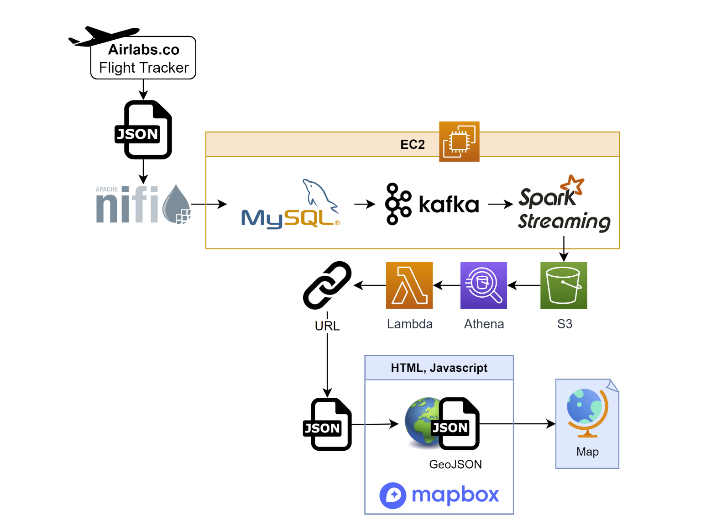

# wcd-final-project-airstream
Streaming flight data from API to live map.

## Presentation
[Slide deck for presentation and demo. ](https://docs.google.com/presentation/d/1AVGM9dwIbtKg4ybZAlIq1ZFDem3R83pShw5UX-ix6OE/edit?usp=sharing)

The slides include some details of the data transformations and a screenshot of the visualization. 
## Architecture
The data pipeline is structured as follows:
1. Data is extracted from airlabs.co by making a http request using Nifi.
2. The response JSON is processed in Nifi and dumped into a MySQL database.
3. The data from MySQL is then streamed through Kafka and Spark Streaming before landing in an S3 bucket in Hudi format.
4. The Hudi data is added to Athena to be made available for querying.
5. A Lambda Function is used to allow the Athena database to be queried via a URL, using an example from [simplemaps](https://simplemaps.com/resources/athena-over-url).
7. An HTML page uses Javascript to
    1. make a request to the URL
    2. convert the received JSON into GeoJSON
    3. visualize the data using Mapbox’s API, following their example of a [live-updating map](https://docs.mapbox.com/mapbox-gl-js/example/live-geojson/).

## Data Transformations
- The raw data is extracted as a JSON object, filtered to flights departing from YYZ (Toronto Pearson Airport). In NIFI, the nested object of interest is specified and split into its constituent objects, each of which contain a record of a flight's position and other attributes.
- Each record is loaded to the MySQL database as a row. The data is now structured such that each row defines a position at a point in time for one flight.
- Minimal transformations are performed in the streaming process. The data is streamed in append mode.
- The Athena query searches for the most recent position of each flight while also filtering out any records with a timestamp beyond a given threshold to exclude stale data. 
- The records returned from making this query over a URL is received as a JSON array. This flat array is converted into a GeoJSON format so that it can be used by Mapbox's API.
