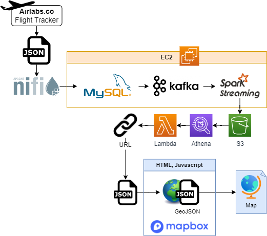

# wcd-final-project-airstream
Streaming flight data from API to live map.

## Presentation
[Slide deck for presentation and demo. ](https://docs.google.com/presentation/d/1AVGM9dwIbtKg4ybZAlIq1ZFDem3R83pShw5UX-ix6OE/edit?usp=sharing)

## Architecture
The data pipeline is structured as follows:
1. Data is extracted from airlabs.co by making a http request using Nifi.
2. The response JSON is processed in Nifi and dumped into a MySQL database.
3. The data from MySQL is then streamed through Kafka and Spark Streaming before landing in an S3 bucket in Hudi format.
4. The Hudi data is added to Athena to be made available for querying.
5. A Lambda Function is used to allow the Athena database to be queried via a URL.
6. An HTML page uses Javascript to
    1. make a request to the URL
    2. convert the received data into GeoJSON
    3. visualize the data using Mapbox’s API.

